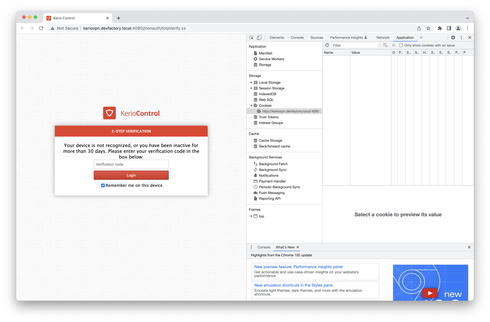
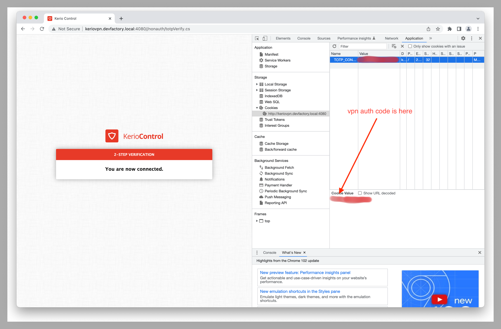

# Connect to the VPN with the Kerio VPN client

Use this action to connect to the VPN using the Kerio VPN client. The Kerio VPN
client which we use here requires a Debian-based environment, it was tested on
`ubuntu-latest`. It is not guaranteed that this action works in any other
environments.

## Parameters

|Parameter Name|Description|
|-|-|
|`vpn-version`|The Kerio VPN client version. The default version is `9.3.5-4367`|
|`vpn-username`|VPN username|
|`vpn-password`|VPN password|
|`vpn-auth-code`|The `TOTP_CONTROL` cookie in 2SV page|

> If you do not have a service account, first request it
[supportportal-df](https://supportportal-df.atlassian.net/servicedesk/customer/portal/6/group/76/create/620).

## How to Get `vpn-auth-code`

This step requires some manual actions. First, login with your service account.
The Kerio VPN Client would open a browser page and ask for the google auth code.



After writing the google auth code, `TOTP_CONTROL` cookie will be there.



## Example usage in github actions

```yaml
# This workflow deploys main to production.

name: Access some resources in central

on:
  pull_request:
    types: [opened, ready_for_review, reopened, synchronize, closed]
  workflow_dispatch:
    branches:
      - '**'

# Environment variables can be overridden in .github/env
env:
  MAIN_PREFIX: main
  GITHUB_TOKEN: ${{ secrets.ENG_STD_TOKEN }}

concurrency:
  group: demo-${{ github.event.number }}
  cancel-in-progress: true

jobs:
  test_vpn:
    name: Test kerio vpn connectivity
    runs-on: ubuntu-latest
    steps:
      - name: Have vpn connection
        uses: trilogy-group/action-kerio-vpn@main
        with:
          # Do not forget to set your username/password and auth code to secrets
          vpn-username: ${{ secrets.VPN_USERNAME }}
          vpn-password: ${{ secrets.VPN_PASSWORD }}
          vpn-auth-code: ${{ secrets.VPN_AUTH_CODE }}
      - name: Check VPN connectivity
        run: |
          nslookup dev.epf.pg.aureacentral.com || exit 1;
          nslookup dev.epf.mysql.aureacentral.com || exit 1;
```